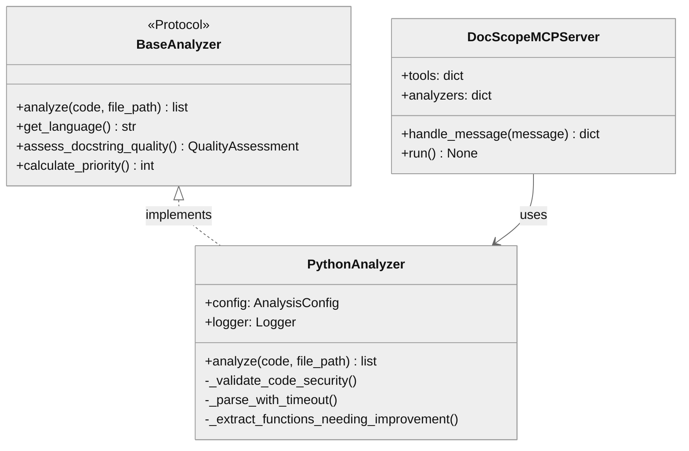

# DocScope MCP - Architecture Contract

## 1. Component Overview

| Attribute | Value |
|-----------|-------|
| **Name** | `docscope_mcp` |
| **Type** | Package (MCP Server) |
| **Responsibility** | Documentation quality analysis via JSON-RPC 2.0 MCP protocol |
| **Language** | Python 3.13+ |
| **Runtime** | stdio transport (spawned by VS Code/Claude Desktop) |
| **State** | Stateless (no persistence between requests) |

### Boundaries
- **Context**: VS Code Copilot, Claude Desktop, MCP-compatible clients
- **Public Surface**: `server.py:DocScopeMCPServer`, `analyzers.python:PythonAnalyzer`

### Patterns
- Protocol-based DI (structural typing)
- AST-based code analysis
- Multi-criteria quality scoring

### Entry Points
| Entry | Purpose |
|-------|---------|
| `python -m docscope_mcp.server` | Start MCP server (stdio) |
| `docscope-mcp install` | Configure VS Code mcp.json |
| `PythonAnalyzer.analyze()` | Direct API usage |

### Key Decisions
| Decision | Rationale | Risk |
|----------|-----------|------|
| Protocol over ABC | Structural typing, no inheritance | Duck typing errors at runtime |
| AST parsing | Accurate function extraction | Memory on large files |
| Signal-based timeout | DoS protection | Unix-only (no Windows timeout) |

---

## 2. Code Layout

```
src/docscope_mcp/
├── __init__.py          # Package exports, version re-export
├── __version__.py       # Version metadata (0.1.0)
├── server.py            # 🔒 MCP server, JSON-RPC handler
├── cli.py               # CLI: install/uninstall commands
├── filesystem.py        # FS abstraction, path security
├── analyzers/
│   ├── __init__.py      # Re-exports BaseAnalyzer
│   ├── base.py          # 🔒 BaseAnalyzer Protocol definition
│   └── python/
│       ├── __init__.py  # Re-exports PythonAnalyzer
│       └── analyzer.py  # 🔒 Python AST analyzer implementation
└── models/
    ├── __init__.py      # Aggregates all model exports
    ├── analysis.py      # ArgInfo, FunctionInfo, FunctionAnalysis
    ├── config.py        # AnalysisConfig, DEFAULT_CONFIG
    └── quality.py       # QualityLevel, QualityIndicators, QualityAssessment
```

---

## 3. Public Surface

### 🔒 Frozen APIs (DO NOT MODIFY without approval)

#### `DocScopeMCPServer`
```python
class DocScopeMCPServer:
    def __init__(config: AnalysisConfig | None, logger: Logger | None) -> None
    async def handle_message(message: dict[str, Any]) -> dict[str, Any]  # 🔒
    async def run() -> None  # 🔒 stdio event loop
```
**Change Impact**: Breaks MCP protocol compatibility with all clients

#### `BaseAnalyzer` Protocol
```python
class BaseAnalyzer(Protocol):
    def analyze(code: str, file_path: str = "") -> list[dict[str, Any]]  # 🔒
    def get_language() -> str  # 🔒
    def assess_docstring_quality(docstring, func_name, func_info) -> QualityAssessment  # 🔒
    def calculate_priority(func_info, quality_assessment) -> int  # 🔒
```
**Change Impact**: Breaks all language analyzer implementations

#### `PythonAnalyzer`
```python
class PythonAnalyzer:
    def analyze(code: str, file_path: str = "") -> list[dict[str, Any]]  # 🔒
    def assess_docstring_quality(...) -> QualityAssessment
    def calculate_priority(...) -> int
```
**Change Impact**: Breaks MCP tool `analyze_functions`

### ⚠️ Internal APIs

| API | Stability |
|-----|-----------|
| `_validate_code_security()` | ⚠️ internal |
| `_parse_with_timeout()` | ⚠️ internal |
| `_extract_functions_needing_improvement()` | ⚠️ internal |
| `PathSecurityValidator` | ⚠️ internal |

### Data Contracts

**Input** (MCP `tools/call`):
```json
{"code": "str", "file_path": "str?", "language": "python"}
```

**Output** (per function):
```json
{
  "function_name": "str",
  "line_number": "int",
  "file_path": "str",
  "current_docstring": "str",
  "quality_assessment": {"quality": "poor|basic|good|excellent", "score": "0.0-1.0", "missing": ["str"]},
  "priority": "int (0-13+)"
}
```

---

## 4. Dependencies

### Internal
| Module | Depends On | Required By |
|--------|------------|-------------|
| `server` | `analyzers.python`, `models` | CLI clients |
| `analyzers.python` | `models` | `server` |
| `models` | (none) | All modules |
| `filesystem` | (none) | (testing infra) |
| `cli` | `__version__` | Entry point |

### External
| Package | Purpose |
|---------|---------|
| Python stdlib | `ast`, `json`, `asyncio`, `signal`, `logging`, `argparse` |

### IO Boundaries
| Type | Details |
|------|---------|
| stdio | JSON-RPC 2.0 messages (stdin→stdout) |
| filesystem | `cli.py` reads/writes `.vscode/mcp.json` |

---

## 5. Invariants & Errors

### ⚠️ MUST PRESERVE

| Invariant | Threshold | Violation |
|-----------|-----------|-----------|
| Code size limit | 5MB max | Returns error dict |
| AST depth limit | 100 max | Returns error dict |
| Parse timeout | 5s max | Returns error dict |
| File path length | 4096 chars | Raises `ValueError` |
| No null bytes in path | - | Raises `ValueError` |

### Security Constraints
- Path traversal blocked via `PathSecurityValidator`
- Symlink targets validated against workspace boundary
- `../` patterns logged as warnings

### Errors Raised

| Error | When | Handler |
|-------|------|---------|
| `ValueError` | Path escapes workspace | `validate_path()` |
| `TypeError` | file_path not string | `_validate_file_path()` |
| `TimeoutError` | Parse exceeds timeout | `_parse_with_timeout()` |
| `SyntaxError` | Invalid Python | Caught, returned as error dict |

### Side Effects
- `cli.py`: Writes `.vscode/mcp.json` or `~/.config/Code/User/mcp.json`
- `server.py`: Writes to stdout (JSON-RPC responses)
- Logging to stderr

---

## 6. Usage

### Quick Start
```python
from docscope_mcp.analyzers.python import PythonAnalyzer

analyzer = PythonAnalyzer()
results = analyzer.analyze(code, "example.py")
for r in results:
    print(f"{r['function_name']}: priority={r['priority']}")
```

### Configuration
| Env/Config | Default | Purpose |
|------------|---------|---------|
| `AnalysisConfig.max_code_size` | 5MB | DoS protection |
| `AnalysisConfig.quality_thresholds` | `{excellent: 0.8, good: 0.6, basic: 0.3}` | Score→level mapping |

### Testing
```bash
pytest tests/ -v           # All tests
pytest tests/test_analyzer.py  # Analyzer only
```

### Pitfalls
| Issue | Fix |
|-------|-----|
| Timeout not working | Windows lacks SIGALRM—timeout skipped |
| Import error in venv | Use `python -m docscope_mcp.server` not script |

---

## 7. AI-Accessibility Map

| Task | Target | Guards | Change Impact |
|------|--------|--------|---------------|
| Add language analyzer | `analyzers/<lang>/analyzer.py` | Implement `BaseAnalyzer` Protocol | Register in `server.py:analyzers` |
| Modify quality scoring | `models/quality.py`, `analyzer.py:_calculate_quality_indicators` | Update thresholds in `config.py` | May change priority rankings |
| Add MCP tool | `server.py:tools`, `handle_message` | Follow JSON-RPC 2.0 | Update tool schema |
| Change security limits | `models/config.py:AnalysisConfig` | Test DoS scenarios | May allow attacks |
| Fix test detection | `analyzer.py:_is_test_function` | Update regex patterns | May misclassify tests |

---

## 8. Architecture Diagram

```mermaid
%%{init: {'theme': 'neutral'}}%%
flowchart TB
    subgraph Clients
        VSCode[VS Code Copilot]
        Claude[Claude Desktop]
    end

    subgraph docscope_mcp
        Server[server.py<br/>DocScopeMCPServer]
        Analyzer[analyzers/python<br/>PythonAnalyzer]
        Models[models/<br/>TypedDicts + Config]
    end

    VSCode -->|stdio JSON-RPC| Server
    Claude -->|stdio JSON-RPC| Server
    Server -->|analyze()| Analyzer
    Analyzer -->|uses| Models
    Server -->|uses| Models
```


