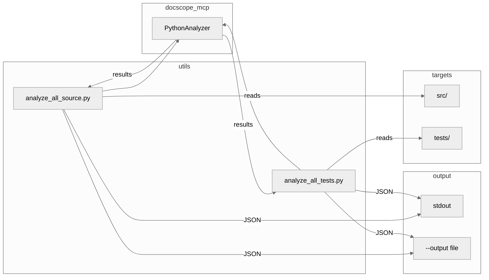

# Utils - Architecture Contract

## 1. Component Overview

| Attribute | Value |
|-----------|-------|
| **Name** | `utils` |
| **Type** | Directory (standalone scripts) |
| **Responsibility** | Batch documentation analysis utilities |
| **Language** | Python 3.13+ |
| **Runtime** | CLI (direct execution) |
| **State** | Stateless |

### Boundaries
- **Context**: Developer workflow, CI/CD pipelines
- **Public Surface**: CLI interface via `python utils/<script>.py`

### Patterns
- Dependency injection (project_root, analyzer params)
- TYPE_CHECKING guard for imports
- JSON output for pipeline integration

### Entry Points
| Entry | Purpose |
|-------|---------|
| `python utils/analyze_all_source.py` | Analyze src/ directory |
| `python utils/analyze_all_tests.py` | Analyze tests/ directory |

### Key Decisions
| Decision | Rationale | Risk |
|----------|-----------|------|
| Standalone scripts | No package install needed | Must run from project root |
| DI parameters | Testability without mocking | Requires caller setup |
| JSON output | Machine-readable for AI prompts | Verbose for humans |

---

## 2. Code Layout

```
utils/
├── analyze_all_source.py   # Batch analyze src/ → JSON report
└── analyze_all_tests.py    # Batch analyze tests/ → JSON report
```

---

## 3. Public Surface

### CLI Interface (⚠️ Stable)

#### `analyze_all_source.py`
```bash
python utils/analyze_all_source.py [--output FILE] [--pretty]
```
| Flag | Purpose |
|------|---------|
| `--output, -o` | Write JSON to file (default: stdout) |
| `--pretty, -p` | Pretty-print with indentation |

#### `analyze_all_tests.py`
```bash
python utils/analyze_all_tests.py [--output FILE] [--pretty]
```
| Flag | Purpose |
|------|---------|
| `--output, -o` | Write JSON to file (default: stdout) |
| `--pretty, -p` | Pretty-print with indentation |

### Functions (⚠️ Internal)

```python
def find_python_files(target_dir: Path) -> list[Path]  # ⚠️ internal
def analyze_file(analyzer, file_path, project_root) -> dict  # ⚠️ internal
def main(project_root: Path | None, analyzer | None) -> int  # ⚠️ internal (DI)
```

### Data Contract (Output JSON)

```json
{
  "report_type": "source_analysis" | "tests_analysis",
  "generated_at": "ISO8601 timestamp",
  "target_directory": "src" | "tests",
  "files_scanned": int,
  "summary": {
    "total_files": int,
    "files_with_issues": int,
    "total_functions_to_improve": int
  },
  "files": [
    {
      "file": "relative/path.py",
      "functions_needing_improvement": int,
      "functions": [
        {
          "name": "func_name",
          "line": int,
          "quality": "poor|basic|good|excellent",
          "priority": int,
          "missing": ["indicator names"],
          "has_docstring": bool
        }
      ]
    }
  ]
}
```

---

## 4. Dependencies

### Internal
| Script | Depends On |
|--------|------------|
| `analyze_all_source.py` | `docscope_mcp.analyzers.python`, `docscope_mcp.models` |
| `analyze_all_tests.py` | `docscope_mcp.analyzers.python`, `docscope_mcp.models` |

### External
| Package | Purpose |
|---------|---------|
| Python stdlib | `argparse`, `json`, `sys`, `pathlib`, `datetime` |

### IO Boundaries
| Type | Details |
|------|---------|
| filesystem | Reads Python files from src/ or tests/ |
| stdout | JSON output (default) |
| filesystem | Optional write to --output file |

---

## 5. Invariants & Errors

### ⚠️ MUST PRESERVE

| Invariant | Verification |
|-----------|--------------|
| Exit 0 on success | `echo $?` after run |
| Exit 1 if no files found | Empty directory |
| JSON always valid | `python -m json.tool` |

### Errors Handled

| Error | When | Behavior |
|-------|------|----------|
| `OSError` | File read fails | Captured in file result |
| `UnicodeDecodeError` | Non-UTF8 file | Captured in file result |
| `SyntaxError` | Invalid Python | Captured in file result |
| `ValueError` | Missing src/ or tests/ | Raised, script exits |

### Side Effects
- Reads files from filesystem (read-only)
- Writes to stdout or --output file
- Modifies `sys.path` (guarded against duplicates)

---

## 6. Usage

### Quick Start
```bash
# Analyze all source files
python utils/analyze_all_source.py

# Save pretty output
python utils/analyze_all_source.py --pretty --output source_report.json

# Analyze all test files
python utils/analyze_all_tests.py --pretty
```

### Programmatic Usage (for testing)
```python
from pathlib import Path
from utils.analyze_all_source import main, find_python_files

# Custom project root
exit_code = main(project_root=Path("/my/project"))

# With mock analyzer
exit_code = main(analyzer=mock_analyzer)

# Just find files
files = find_python_files(Path("src"))
```

### Configuration
| Config | Default | Purpose |
|--------|---------|---------|
| `EXCLUDED_PATTERNS` | `("__pycache__", ".pyc")` | Skip cache/bytecode |

### Pitfalls
| Issue | Fix |
|-------|-----|
| `ModuleNotFoundError` | Run from project root, not utils/ |
| Empty output | Check src/ or tests/ exists |

---

## 7. AI-Accessibility Map

| Task | Target | Guards | Change Impact |
|------|--------|--------|---------------|
| Add output format | `main()` argparse | Update JSON schema | Consumers must update |
| Change exclusions | `EXCLUDED_PATTERNS` | Test with edge cases | May include unwanted files |
| Add new analysis target | Create `analyze_all_<target>.py` | Copy pattern from existing | New script |
| Modify JSON schema | `analyze_file()`, `main()` | Update data contract docs | Downstream tools break |

---

## 8. Data Flow


