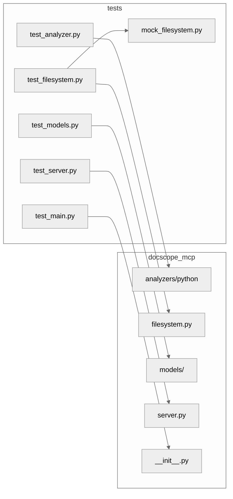
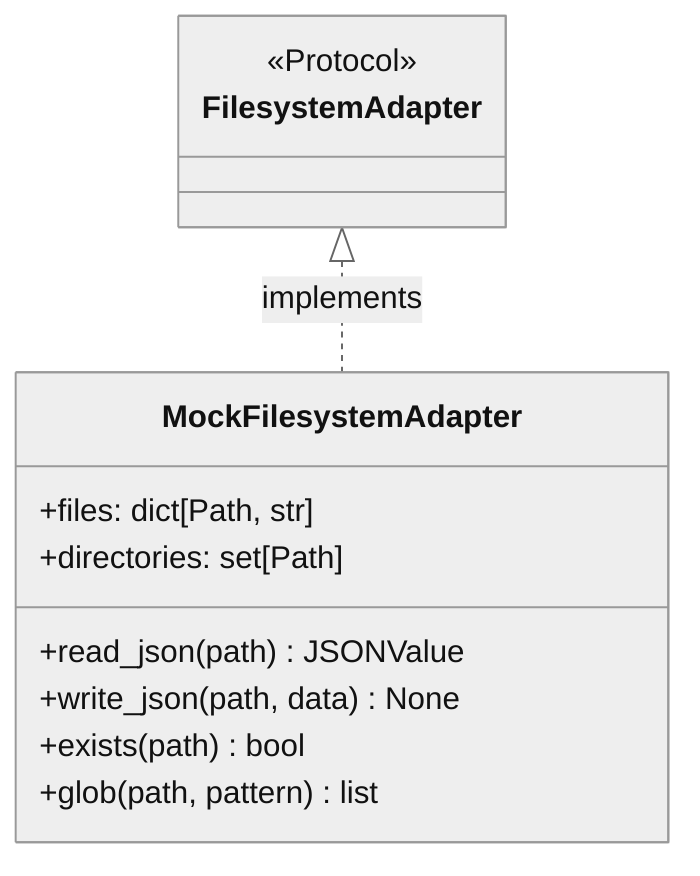

# Tests - Architecture Contract

## 1. Component Overview

| Attribute | Value |
|-----------|-------|
| **Name** | `tests` |
| **Type** | Package (pytest test suite) |
| **Responsibility** | Unit/integration tests for docscope_mcp |
| **Language** | Python 3.13+ |
| **Runtime** | pytest |
| **State** | Stateless (mock filesystem, no I/O) |

### Boundaries
- **Context**: Developer CI/CD, local testing
- **Public Surface**: `MockFilesystemAdapter` (test utility)

### Patterns
- AAA docstring pattern (Arrange-Act-Assert in test docs)
- Mock-based isolation (no real filesystem I/O)
- Class-based test organization by component

### Entry Points
| Entry | Purpose |
|-------|---------|
| `pytest tests/` | Run all tests |
| `pytest tests/test_analyzer.py` | Analyzer tests only |
| `MockFilesystemAdapter` | Reusable mock for new tests |

---

## 2. Code Layout

```
tests/
├── __init__.py           # Package docstring
├── mock_filesystem.py    # 🔒 In-memory filesystem mock
├── test_analyzer.py      # PythonAnalyzer tests (6 classes)
├── test_filesystem.py    # Filesystem adapter tests (3 classes)
├── test_main.py          # Package import smoke tests
├── test_models.py        # Model tests (3 classes)
└── test_server.py        # MCP server tests (2 classes)
```

---

## 3. Public Surface

### 🔒 Frozen APIs

#### `MockFilesystemAdapter`
```python
class MockFilesystemAdapter:
    files: dict[Path, str]
    directories: set[Path]
    def copy_file(src, dst) -> None
    def mkdir(path, parents=True, exist_ok=True) -> None
    def read_json(path) -> JSONValue
    def write_json(path, data) -> None
    def exists(path) -> bool
    def glob(path, pattern) -> list[Path]
    def resolve(path) -> Path
    def validate_path(path, workspace) -> Path
    def remove(path) -> None
    def read_text(path) -> str
    def write_text(path, content) -> None
```
**Change Impact**: Breaks test isolation across test modules

### Test Classes (⚠️ Internal)

| File | Classes | Test Count |
|------|---------|------------|
| `test_analyzer.py` | `TestPythonAnalyzerBasic`, `TestPythonAnalyzerAnalysis`, `TestPythonAnalyzerQuality`, `TestPythonAnalyzerPriority`, `TestPythonAnalyzerTestDetection`, `TestPythonAnalyzerSecurity` | ~25 |
| `test_filesystem.py` | `TestMockFilesystemAdapter`, `TestDefaultFilesystemAdapter`, `TestPathSecurityValidator` | ~15 |
| `test_main.py` | (module-level) | 3 |
| `test_models.py` | `TestQualityLevel`, `TestQualityThresholds`, `TestAnalysisConfig` | ~8 |
| `test_server.py` | `TestDocScopeMCPServer`, `TestResultFormatting` | ~8 |

---

## 4. Dependencies

### Internal
| Module | Depends On |
|--------|------------|
| `test_analyzer.py` | `docscope_mcp.analyzers.python` |
| `test_filesystem.py` | `docscope_mcp.filesystem`, `mock_filesystem` |
| `test_models.py` | `docscope_mcp.models` |
| `test_server.py` | `docscope_mcp.server` |
| `mock_filesystem.py` | (none - standalone) |

### External
| Package | Purpose |
|---------|---------|
| `pytest` | Test framework |

### IO Boundaries
| Type | Details |
|------|---------|
| None | All tests use mocks, no real I/O |

---

## 5. Invariants & Errors

### ⚠️ MUST PRESERVE

| Invariant | Verification |
|-----------|--------------|
| 53 tests pass | `pytest tests/ -v` |
| No real filesystem I/O | All tests use `MockFilesystemAdapter` or pure paths |
| AAA docstring format | Each test has Business context on separate line |

### Test Commands
```bash
pytest tests/ -v                    # All tests
pytest tests/ -v --tb=short         # With short traceback
pytest tests/test_analyzer.py -k "test_security"  # Filter
```

### Constraints
- Tests must not create temp files (use mocks)
- Tests must not make network calls
- Test docstrings must follow AAA pattern

---

## 6. Usage

### Running Tests
```bash
# All tests
pytest tests/ -v

# With coverage
pytest tests/ --cov=docscope_mcp --cov-report=term-missing

# Specific test file
pytest tests/test_analyzer.py -v

# Specific test
pytest tests/test_analyzer.py::TestPythonAnalyzerBasic::test_default_config -v
```

### Using MockFilesystemAdapter
```python
from pathlib import Path
from tests.mock_filesystem import MockFilesystemAdapter

fs = MockFilesystemAdapter()
fs.files[Path("config.json")] = '{"key": "value"}'
data = fs.read_json(Path("config.json"))  # {'key': 'value'}
```

### Writing New Tests
```python
def test_feature_works() -> None:
    """Verify feature handles input correctly.

    Business context:
    Feature enables X for users doing Y.

    Arrange: Setup mock with test data.
    Act: Call feature with inputs.
    Assert: Verify expected outputs.
    """
    # Arrange
    fs = MockFilesystemAdapter()
    fs.files[Path("input.txt")] = "data"

    # Act
    result = some_function(fs)

    # Assert
    assert result == expected
```

### Pitfalls
| Issue | Fix |
|-------|-----|
| Import error for `tests.mock_filesystem` | Run from project root with `pytest` |
| Test using real paths | Replace with `MockFilesystemAdapter` |

---

## 7. AI-Accessibility Map

| Task | Target | Guards | Change Impact |
|------|--------|--------|---------------|
| Add analyzer test | `test_analyzer.py` | Follow AAA docstring format | Coverage change |
| Add server test | `test_server.py` | Mock JSON-RPC messages | Coverage change |
| Fix mock behavior | `mock_filesystem.py` | Match `FilesystemAdapter` Protocol | May break existing tests |
| Add new test file | `tests/test_<component>.py` | Import in `__init__.py` optional | pytest auto-discovers |

---

## 8. Test Coverage Map




